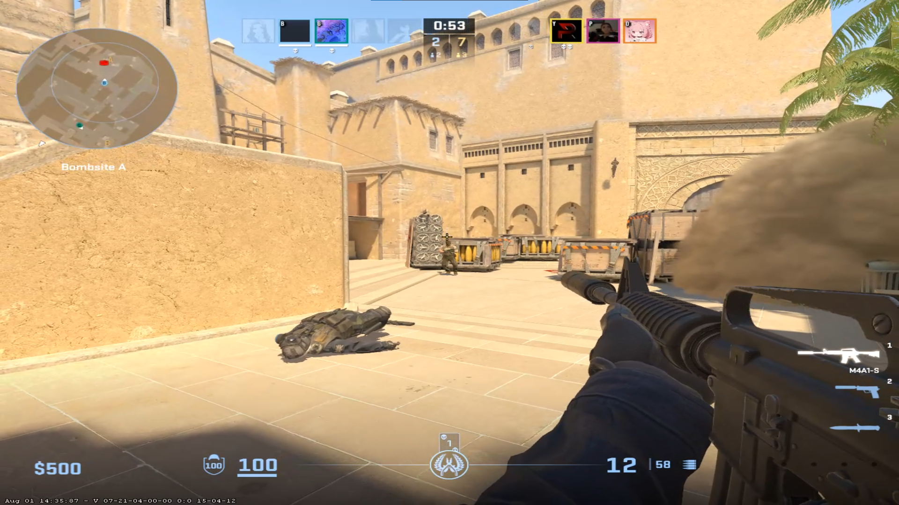

# 2bars

Smooth Cinematic Overlay for Clutches in CS2. A simple Python app that adds cinematic black bars at the top and bottom of your screen.

---

## Features

- Smooth animated black bars that slide in/out with easing
- Clean transparent overlay
- Global hotkey (`Ctrl + Alt + C`) to toggle bars on and off
- Very Lightweight and minimal dependencies

---

## Screenshots
With Overlay             |  Without Overlay
:-------------------------:|:-------------------------:
  |  

## Requirements

- Python 3.6+
- PyQt5
- keyboard (for global hotkey support)

---

## Installation

1. Clone or download this repo.
2. Install dependencies:

   ```bash
   pip install -r requirements.txt
   ```

---

## Usage

```python

python 2bars.py
```

##### Press Ctrl + Alt + C to toggle the cinematic bars overlay on or off.

---

## Notes

- Use Fullscreen Windowed if not working.

- The app uses global keyboard hooks — running it may require admin or elevated privileges on some platforms.

- Only tested on Windows and Linux; macOS support may vary.
- [VT Scan False positive](https://www.virustotal.com/gui/file/a315d472a573d76ccaf584089d14c2f634591cbd9eade2de257c8b1f0deb02ae?nocache=1)

---
## Using nuitka

#### Windows
```bash
python -m nuitka --onefile --windows-icon-from-ico=2bars.ico --enable-plugin=pyqt5 --include-module=keyboard 2bars.py
```

####  Having trouble or Want to Join the Discord?

- [Open a issue](https://github.com/v4ish/2bars/issues)
- [Join Discord](https://dsc.gg/v4ish)
